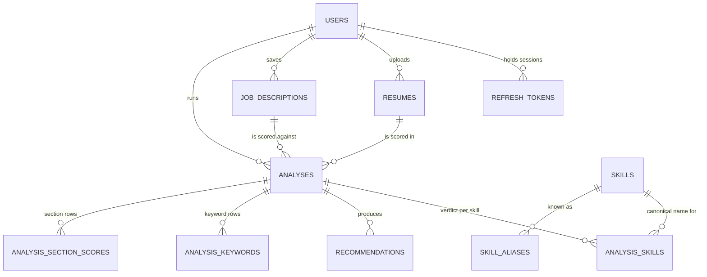

# Database design

The schema is written once, in JPA annotations, and generated from there. Both profiles currently
use Hibernate's `ddl-auto: update`, which is right for a project still adding tables and wrong for
one with users — the intended end state is versioned migrations with `ddl-auto: validate`, so that
a schema change is a reviewable file rather than a side effect of starting the app. Until then the
annotations are the source of truth for column names, lengths, indexes and constraint names, which
is why every constraint name is spelled out explicitly rather than left to Hibernate's generator.
A constraint that appears in a production error log is only useful if you can search the codebase
for its name.

Two rules shape every table below.

Every row that belongs to a person is reachable from a `user_id` in one hop, so ownership is a
`where` clause rather than a walk through relationships in Java. The one exception is
`recommendations`, which reaches its owner through `analysis_id` — advice has no meaning apart
from the run that produced it, so giving it its own `user_id` would create a second copy of the
same fact and a second chance for the two to disagree.

Nothing sensitive is reachable by accident. Extracted resume text and raw posting text are
`LONGTEXT` columns that no list query selects; the list endpoints read interface projections
(`ResumeSummary`, `JobDescriptionSummary`, `AnalysisSummary`) that have no accessor for those
columns at all, so the text is not merely filtered out of the response — it is never read out of
the database.

## Entity relationships



`analysis_skills` is the table that makes the relational model worth it. The skill-gap page asks
"which skills has this user been missing most often, across every analysis?", and that is one
`group by` over this table. Embedded as an array inside an analysis document it would be an
aggregation over arrays of arrays, recomputed on every page load.

## Tables

### `users`

| Column | Type | Notes |
| --- | --- | --- |
| `id` | `bigint` PK | Surrogate key, auto-increment. Never leaves the backend. |
| `public_id` | `char(36)` | Random UUID, unique, immutable. This is the id in URLs, DTOs and logs. |
| `email` | `varchar(180)` | Unique (`uk_users_email`). Stored lower-cased and trimmed. |
| `password_hash` | `varchar(100)` | BCrypt hash. Sized for the 60-char output with room for a future algorithm prefix. |
| `full_name` | `varchar(120)` | |
| `target_role` | `varchar(120)` | Optional. Seeds the job title on a new analysis. |
| `experience_level` | `varchar(20)` | `ENTRY, JUNIOR, MID, SENIOR, LEAD`. Optional. |
| `role` | `varchar(20)` | `USER, ADMIN`. |
| `last_login_at` | `datetime(6)` | |
| `created_at`, `updated_at` | `datetime(6)` | On every table; written by JPA lifecycle callbacks. |

Email uniqueness is enforced by the database, not only by a service check, because two
registrations arriving at the same moment both pass the check. Normalisation happens on every
write path — the domain factory, the setter, and a `@PrePersist`/`@PreUpdate` callback — since
Lombok's builder bypasses setters and a unique index on a case-sensitive column would otherwise
accept `Rohit@x.com` alongside `rohit@x.com`.

### `refresh_tokens`

| Column | Type | Notes |
| --- | --- | --- |
| `user_id` | `bigint` FK → `users` | `fk_refresh_tokens_user`, lazy, not null. Indexed (`idx_refresh_tokens_user`). |
| `token_hash` | `char(64)` | SHA-256 of the token, hex encoded. Unique (`uk_refresh_tokens_token_hash`). |
| `family_id` | `char(36)` | Groups every token descended from one sign-in. Immutable. Indexed (`idx_refresh_tokens_family`). |
| `expires_at` | `datetime(6)` | Absolute expiry of this token, not of the session. |
| `revoked_at` | `datetime(6)` | Null while live. Set once, never cleared. |
| `revoked_reason` | `varchar(20)` | `ROTATED, SIGNED_OUT, REUSE_DETECTED`. The first reason wins. |

This is the one table that exists because a JWT cannot be taken back. An access token is valid
until it expires and nothing can stop it, which is the whole trade a stateless token makes — so
the long-lived half of a session is a row instead, and signing out becomes an `update` rather
than a hope.

Only the digest is stored, so a dump of this table cannot be replayed against the API. BCrypt is
deliberately not used: these are 256 random bits from a CSPRNG, so there is no dictionary to slow
down, and a per-request BCrypt verification would have to scan candidate rows instead of looking
one up on a unique index.

Rotation is what `family_id` is for. Every refresh spends the presented token and issues a
successor in the same family, so a stolen token is only useful until the real browser refreshes
next. When a token that has already been spent is presented again, the entire family is revoked in
one statement: the server cannot tell which of the two holders is the legitimate one, so it ends
the session and both must sign in again. A false alarm costs one sign-in; the alternative costs the
account.

Revoked rows are kept rather than deleted, because a deleted row is indistinguishable from a token
that never existed and reuse detection depends on telling those apart. Expired rows are swept
separately by `deleteByExpiresAtBefore` — once a token is past its expiry it fails that check
before reuse detection is ever consulted, so its history has no further value.

One account holds at most five live sessions. Sessions are per device, so a handful is normal and a
hundred is not: the cap keeps a stolen password from accumulating an unbounded set of resumable
sessions, and keeps one user from growing this table without limit. The oldest family is evicted
first, so the device you used least recently is the one that asks for a password again.

### `resumes`

| Column | Type | Notes |
| --- | --- | --- |
| `user_id` | `bigint` FK → `users` | `fk_resumes_user`, lazy, not null. |
| `label` | `varchar(140)` | What the user calls this resume. |
| `original_filename` | `varchar(255)` | Kept for display only; never used to build a path. |
| `storage_key` | `varchar(200)` | Server-generated, unique index `ix_resumes_storage_key`. |
| `content_type` | `varchar(100)` | |
| `file_size_bytes` | `bigint` | |
| `page_count`, `word_count` | `int` | Null until extraction succeeds. |
| `extracted_text` | `longtext` | `@Lob`. The sensitive column — see above. |
| `status` | `varchar(30)` | `UPLOADED, TEXT_EXTRACTED, EXTRACTION_FAILED`. |
| `extraction_error` | `varchar(300)` | A sentence for the user, not a stack trace. |

The uploaded filename and the stored key are two different columns on purpose. Storing a file
under a name the user chose is how path traversal gets in; the key is generated server-side, and
the index on it is unique so a collision fails loudly at insert rather than silently overwriting
somebody else's resume.

Index `ix_resumes_user_created` on `(user_id, created_at)` matches the only way this table is
listed: one user's resumes, newest first.

### `job_descriptions`

| Column | Type | Notes |
| --- | --- | --- |
| `user_id` | `bigint` FK → `users` | `fk_job_descriptions_user`. |
| `title` | `varchar(160)` | |
| `company` | `varchar(160)` | Optional. |
| `raw_text` | `longtext` | `@Lob`, not null. |
| `content_hash` | `char(64)` | SHA-256 of the normalised text. Unique per user. |

The unique constraint is `(user_id, content_hash)`, not `content_hash` alone. A user who pastes
the same posting twice should get the same row back rather than a duplicate, but a globally
unique hash would let one user's insert fail because a stranger had already saved that posting —
and would leak, by inference, that somebody else is applying to the same job.

The hash is computed over case-folded, whitespace-collapsed text, so a re-paste with different
line breaks still matches. Null and blank hash to the same value, deliberately: an empty posting
is an empty posting.

### `analyses`

| Column | Type | Notes |
| --- | --- | --- |
| `user_id` | `bigint` FK → `users` | `fk_analyses_user`. Denormalised on purpose: it could be reached through `resume_id`, but every read of this table filters by owner. |
| `resume_id` | `bigint` FK → `resumes` | `fk_analyses_resume`. |
| `job_description_id` | `bigint` FK → `job_descriptions` | `fk_analyses_job_description`. |
| `status` | `varchar(20)` | `QUEUED, PROCESSING, COMPLETED, FAILED`. |
| `overall_score`, `ats_score`, `job_match_score`, `skills_match_score`, `keyword_score`, `experience_score` | `int` | Nullable. A queued or failed run has no scores, and 0 is a verdict, not an absence. |
| `overall_feedback` | `longtext` | |
| `raw_response` | `longtext` | The model's untouched JSON, kept for debugging a bad parse. Never returned by an endpoint. |
| `ai_model`, `analyzer_version` | `varchar(100)`, `varchar(20)` | Which model and which prompt version produced this row, so a score can be interpreted months later. |
| `processing_ms` | `int` | |
| `failure_reason` | `varchar(300)` | |
| `completed_at` | `datetime(6)` | |

Indexes `ix_analyses_user_created` and `ix_analyses_user_status` cover the history list and the
dashboard counts; `ix_analyses_resume` covers the delete-resume path, which has to clear
analyses first.

The score columns being nullable is what lets the dashboard tell the difference between "no
analyses yet" and "an average of zero". SQL's `avg()` over no rows returns null, and the API
passes that null through rather than defaulting it — a brand-new account showing an overall score
of 0 reads as a judgement of the user's resume.

### `analysis_skills`

| Column | Type | Notes |
| --- | --- | --- |
| `analysis_id` | `bigint` FK → `analyses` | `fk_analysis_skills_analysis`. |
| `skill_id` | `bigint` FK → `skills` | **Nullable.** Null when the mention did not resolve. |
| `raw_name` | `varchar(80)` | Exactly what the posting or the model called it. |
| `status` | `varchar(20)` | `STRONG, PARTIAL, MISSING`. |
| `importance` | `varchar(20)` | `CRITICAL, IMPORTANT, NICE_TO_HAVE`. |
| `evidence` | `varchar(400)` | Where the resume supports this skill. Null for a missing skill. |

`skill_id` is nullable because the model can name something the taxonomy has never heard of, and
dropping those rows would quietly remove the single most unusual requirement from the gap list —
the one the user most needs to see. Unresolved mentions are kept with `raw_name` set, still
count towards the analysis, and are the queue of skills to add to the taxonomy next.

The unique constraint is `(analysis_id, raw_name)` rather than `(analysis_id, skill_id)` because
MySQL permits unlimited nulls in a unique index: a constraint on the nullable column would
enforce nothing at all for exactly the rows most likely to be duplicated.

`evidence` is what keeps the advice truthful. A suggestion to strengthen a skill is only
legitimate if the resume already supports it somewhere, and storing the supporting line makes
that checkable instead of a claim the model makes about itself.

### `recommendations`

| Column | Type | Notes |
| --- | --- | --- |
| `analysis_id` | `bigint` FK → `analyses` | `fk_recommendations_analysis`. The only path to an owner. |
| `type` | `varchar(20)` | `IMPROVEMENT, LEARNING, PROJECT, KEYWORD`. |
| `title` | `varchar(160)` | |
| `detail` | `varchar(2000)` | Bounded on purpose, not a `@Lob`. |
| `priority` | `varchar(10)` | `HIGH, MEDIUM, LOW`. |
| `display_order` | `int` | The model's own ordering within a type. |
| `resource_url` | `varchar(300)` | Optional; mostly on `LEARNING` rows. |

`detail` being a bounded `varchar(2000)` is a product constraint expressed in the schema. Advice
a person can act on is two or three sentences, and a column that permits four kilobytes invites
an essay nobody reads.

### `skills` and `skill_aliases`

| Column | Type | Notes |
| --- | --- | --- |
| `skills.slug` | `varchar(80)` | Unique (`uk_skills_slug`). Derived, never hand-written. |
| `skills.display_name` | `varchar(80)` | What the UI shows: `C++`, `.NET`, `Node.js`. |
| `skills.category` | `varchar(20)` | `LANGUAGE, FRAMEWORK, DATABASE, CLOUD, DEVOPS, TESTING, TOOLING, DATA_AI, MOBILE, CONCEPT, SOFT_SKILL`. |
| `skill_aliases.skill_id` | `bigint` FK → `skills` | `fk_skill_aliases_skill`, cascading element collection. |
| `skill_aliases.alias` | `varchar(80)` | Unique **globally** (`uk_skill_aliases_alias`). |

Slugging is the whole canonicalisation mechanism: `Spring Boot`, `spring-boot` and `SpringBoot`
all have to become one row, while `C`, `C++` and `C#` must stay three. Punctuation is therefore
handled by position and by meaning rather than stripped — `+` becomes `plus`, `#` becomes `sharp`,
a leading dot is spelled out (`.NET` → `dotnet`) and an interior dot separates (`Node.js` →
`node-js`). The failure mode is invisible in the UI, which is why it has its own test class: a
skill that slugs wrongly does not error, it just becomes a second skill nobody ever matches.

Aliases are globally unique because resolution has to be deterministic. If `k8s` could belong to
two skills, which skill a resume matched would depend on row order.

### `analysis_keywords`, `analysis_section_scores` and `analysis_score_notes`

All three are `@ElementCollection` tables — child rows with no identity of their own, no id column,
and no life outside their analysis.

`analysis_keywords` holds `kind` (`MATCHED, SUGGESTED, ABSENT`), `term` and `placement`.
`placement` is the reason this is a table and not a list of strings: a suggested keyword always
travels with where it honestly belongs in the resume. A bare list of keywords to add is a keyword
stuffing tool, and the product refuses to be one.

`analysis_section_scores` holds `section` (`CONTACT, SUMMARY, SKILLS, EXPERIENCE, PROJECTS,
EDUCATION, CERTIFICATIONS, FORMATTING`), `score` and `note`.

`analysis_score_notes` holds `label`, `earned`, `out_of` and `comment` — one row per component of a
score, which together are why the number is the number ("Required skills: 22 of 30 — 6 of 8 named").
It is stored rather than recomputed, and that is the whole point of the table. The scores come from a
skill catalogue and a set of weights that both change as the product grows, so recomputing the
reasons when somebody opens a three-month-old analysis would explain it with today's rules and
quietly disagree with the number stored beside them. Storing them makes an old analysis as
answerable as a fresh one, which is the difference between a score and a verdict.

## Decisions worth defending

**Two identifiers per row.** A `bigint` primary key for joins and index size, and a random
`public_id` UUID for anything the outside world sees. Sequential ids in URLs invite enumeration:
subtract one from `/api/analyses/42` and you are asking for somebody else's analysis. Ownership
is still checked on every read, but the id shape means a wrong guess is not even reachable.

**Ownership in the query, not after it.** Every finder is `findByPublicIdAndUserId`, so the
authorisation rule is part of the method signature and cannot be forgotten at a call site. A
miss returns an empty `Optional`, which becomes a 404 — a 403 would confirm that the row exists.

**Enums stored as names.** `@Enumerated(STRING)` everywhere. With JPA's default of `ORDINAL`,
inserting a constant in the middle of an enum silently reinterprets every existing row, and the
data looks fine while meaning something else. The cost is that `order by type` sorts
alphabetically on the stored text rather than by declaration order — which the recommendation
tests assert explicitly, since that is the grouping the UI shows.

**Lazy on every `@ManyToOne`.** JPA's default is eager, which would fetch a whole user row every
time a resume is loaded for any reason. `open-in-view` is disabled, so anything the web layer
needs must be fetched deliberately: the analysis detail read uses an entity graph to pull skills,
their canonical skill, and recommendations in one query, and the tests detach the result to prove
it, since a `LazyInitializationException` is exactly what production would throw.

**Collections are exposed as unmodifiable views.** With `orphanRemoval = true`, replacing a
collection through a setter deletes every child row, and adding through a getter sets only one
side of the relationship so the child inserts with a null `analysis_id`. The entities therefore
have no collection setters — only `addSkill`, `addRecommendation`, `addKeyword` and
`addSectionAssessment`, which maintain both sides.

**Deletes carry their own transaction.** Every derived `deleteBy…` is annotated
`@Transactional`. Spring Data's generated implementation is `@Transactional(readOnly = true)`,
which leaves Hibernate in `FlushMode.MANUAL`: a derived delete then loads the rows, removes them
from the session, never flushes, and still returns a count. The failure is silent and invisible to
the repository slice tests, because those supply a transaction of their own —
`ResumeDeleteCommitsTest` is therefore the one test that deliberately runs without one, and reads
the row back in a fresh session.

**Reference data seeded in Java, not `data.sql`.** `SkillCatalogSeeder` is an
`ApplicationRunner` that reads `data/skills.json`, derives every slug through the same
`Skill.slugify` the application uses, and is idempotent by slug — restarting the app is free.
A `data.sql` file would need `INSERT IGNORE` (MySQL-only, so H2 tests would diverge), would
hand-write slugs that could drift from the code, and could not be unit-tested. Seeding is
switched off with `SEED_SKILLS=false`.

## Running against MySQL

Development defaults to H2 in `MODE=MySQL` so the project starts with no local database
(`--spring.profiles.active=dev`). The `mysql` profile points at a real server through
environment variables only — no credentials in the repository:

```
DB_URL=jdbc:mysql://localhost:3306/resumeiq
DB_USERNAME=resumeiq
DB_PASSWORD=…
```

The repository tests run against H2 in MySQL mode rather than H2's own default, so the differences
that matter here — `LONGTEXT` mapping, unlimited nulls in a unique index, case-insensitive
identifiers — behave in the suite the way they will in production. Where a difference cannot be
papered over it is avoided instead: the dashboard-average test uses scores of 70 and 82 so the
expected average is exactly 76.0 and the assertion does not depend on how either engine scales the
result of `avg()` over an integer column.
